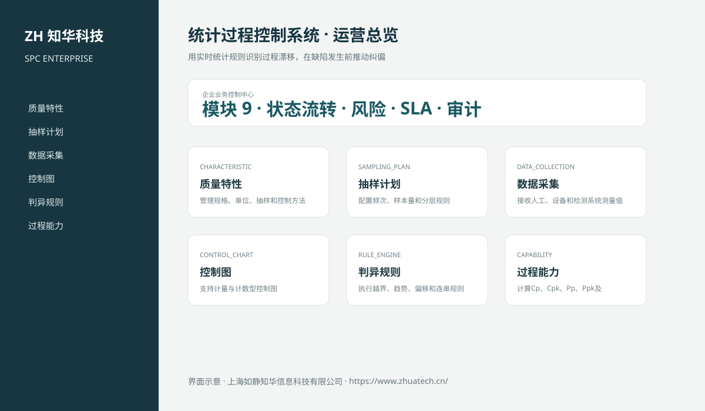

# ZhuaTech SPC｜统计过程控制系统

> 用实时统计规则识别过程漂移，在缺陷发生前推动纠偏

ZhuaTech SPC 是知华科技（上海如静知华信息科技有限公司）发布的企业级源码项目，面向“特性、采样、控制图、规则判异、过程能力、异常、纠正措施与分析”提供管理端与响应式业务端。工程采用前后端分离架构，所有示例数据均为虚构数据。

[知华科技官网](https://www.zhuatech.cn/) · [架构说明](docs/ARCHITECTURE.md) · [API 文档](docs/API.md) · [企业能力](docs/ENTERPRISE.md) · [测试说明](docs/TESTING.md)



## 业务模块

| 模块 | 核心能力 |
| --- | --- |
| 质量特性 | 管理规格、单位、抽样和控制方法 |
| 抽样计划 | 配置频次、样本量和分层规则 |
| 数据采集 | 接收人工、设备和检测系统测量值 |
| 控制图 | 支持计量与计数型控制图 |
| 判异规则 | 执行越界、趋势、偏移和连串规则 |
| 过程能力 | 计算Cp、Cpk、Pp、Ppk及分布 |
| 异常预警 | 通知责任人并限制异常过程放行 |
| 纠正措施 | 记录原因、措施、验证和关闭 |
| 质量分析 | 按产品、设备、班组和期间分析 |


## 企业级控制

- ADMIN / OPERATOR 角色边界和管理员接口隔离；
- 服务端字段、模块、唯一编号和状态迁移校验；
- 组织、期间、责任人、风险等级、到期日和 SLA 统计；
- 幂等创建、JPA 乐观锁、重复提交保护和职责分离；
- 附件 SHA-256 元数据、业务凭证完整性与全流程审计；
- 组合检索、分页、逾期筛选、UTF-8 CSV 导出和协作时间线；
- 外部系统仅预留适配器，使用方自行配置地址与凭据；
- prod profile 拒绝默认密码、弱数据库口令和本地跨域来源。

## 技术架构

- 后端：Java 21、Spring Boot、Spring Security、JPA、Bean Validation、Actuator
- 前端：Vue 3、Vite、Axios，支持桌面端与移动端响应式布局
- 数据库：MySQL 8；自动化测试使用 H2
- 交付：Docker Compose、Nginx、环境变量、GitHub Actions
- Java 包名：`cn.zhuatech.spc`

## 启动与测试

```bash
cd backend && mvn test
cd ../frontend && npm install && npm run build
cd .. && cp .env.example .env && docker compose up --build
```

开发演示账号：`admin / admin123`、`operator / operator123`。生产环境必须通过环境变量替换全部默认凭据。

## 许可与商业授权

Copyright © 2026 上海如静知华信息科技有限公司。

本工程仅允许个人学习、研究和非商业技术交流，**不得用于商业用途**。企业内部使用、生产部署、SaaS运营、项目交付、品牌替换、收费培训、咨询实施或再分发，均须事先获得上海如静知华信息科技有限公司书面授权，详见 [LICENSE](LICENSE)。

深度开发、私有化部署、系统集成与企业数字化咨询，请访问[知华科技官网](https://www.zhuatech.cn/)或扫码联系：

| 微信咨询一 | 微信咨询二 |
| --- | --- |
|  |  |

SEO：统计过程控制系统、SPC系统源码、企业数字化、Java企业系统、Vue管理系统、知华科技、上海如静知华信息科技有限公司。

## V2.0 专业过程控制域

新增质量特性、规格与控制限、样本、判异信号和 CAPA 模型。系统计算 Cp/Cpk，自动执行三西格玛越界和连续八点同侧规则；异常必须经过分派、原因分析、纠正措施、证据登记和独立有效性验证。专业入口为“过程控制中心”，API 根路径为 `/api/spc-ops`。
